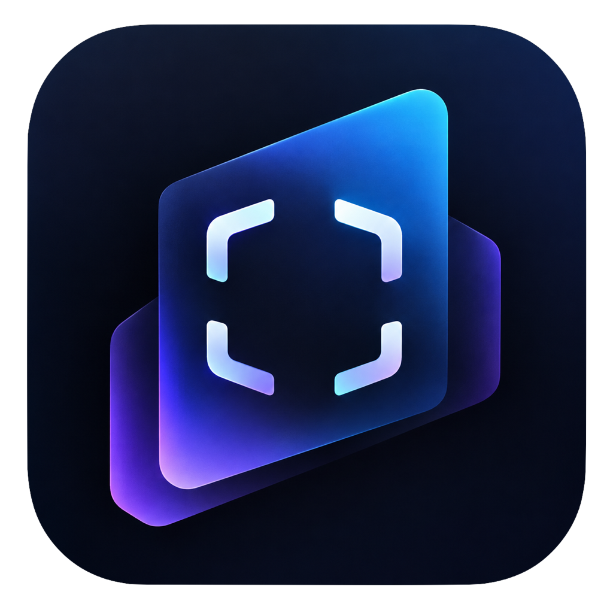

<p align="center">
  
</p>

<h1 align="center">Snapcase</h1>

Snapcase は、手動テストの記録（スクリーンショット・コード・表・判定）をテストケースごとに整理して残せるデスクトップアプリです。
書き出しは PDF / Excel / HTML / Markdown に対応し、Windows・macOS・Linux（ベストエフォート）で使えます。

## 技術スタック

| 分類 | 技術 |
| --- | --- |
| デスクトップ基盤 | Electron |
| 開発/ビルド | electron-vite, Vite |
| UI | React, TypeScript |
| テスト | Vitest |
| Lint / Format | ESLint, Prettier |
| パッケージング | electron-builder |
| Excel 書き出し | exceljs |
| コードハイライト | highlight.js |
| ウィンドウ一覧取得 | get-windows |

## インストール

[Releases](https://github.com/kissy1221/snapcase/releases) から OS に合ったファイルをダウンロードする。

- **Windows**: `snapcase-<版>-win-setup.exe` を実行（インストール不要なら `-win-portable.exe`）。SmartScreen が出たら「詳細情報 → 実行」を選ぶ。
- **macOS**: `snapcase-<版>-mac-arm64.dmg`（Apple Silicon）または `-mac-x64.dmg`（Intel）を開いてインストール。署名なしのため、初回は「システム設定 → プライバシーとセキュリティ」の「このまま開く」が必要。
- **Linux**: `snapcase-<版>-linux-x86_64.AppImage` をダウンロードし、`chmod +x` してから実行。

初回の撮影時、macOS では「画面収録」の許可が必要（設定で許可したあとアプリを再起動する）。

## ビルド方法

```
npm install
npm run build:mac    # / build:win / build:linux（成果物は dist/）
```

開発中に起動するだけなら `npm run dev`。詳しいリリース手順は [docs/release.md](docs/release.md) を参照。
